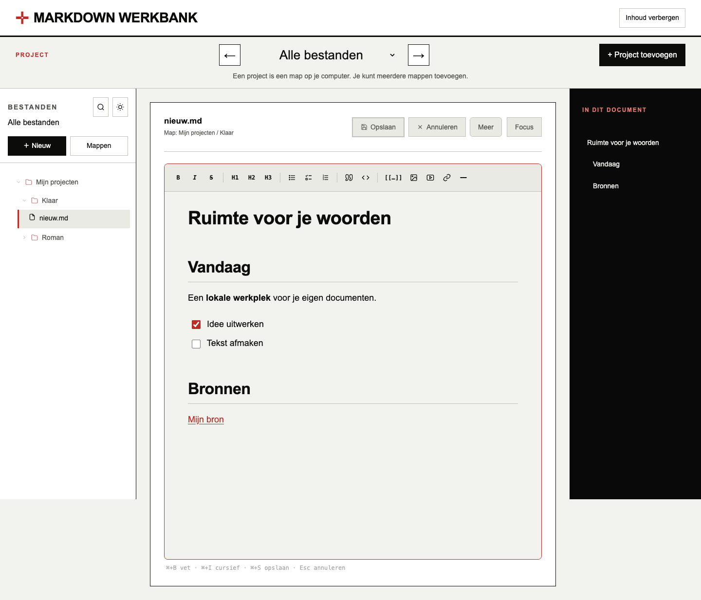

# Markdown Werkbank

Een lokale Markdown-werkplek met opgemaakte editor, bestandsbeheer en Focus. Rood, zwart en wit. Je documenten blijven op je eigen computer. Geen account, AI, API-sleutel, server of installatie.

**[Download de Werkbank](https://github.com/erwinblom/markdown-werkbank-offline/releases/latest/download/markdown-werkbank-offline.zip)** — pak de ZIP volledig uit en open `index.html` in Chrome of Edge.

**Begin met [START HIER.txt](START%20HIER.txt).** Dit is de zelfstandige offline versie, zonder AI-schrijfpartner.

## Beginnen

1. Pak de volledige ZIP uit op een vaste plek op je computer.
2. Open **index.html in Google Chrome of Microsoft Edge** op je computer (rechtermuisknop → Open met).
3. Kies **+ Project toevoegen**, selecteer een werkmap en geef toestemming. Je nieuwe project wordt meteen geselecteerd. Herhaal dit om meer projecten toe te voegen.
4. Open links een Markdown-bestand en kies **Bewerken**.

Houd de HTML, scripts, stijlbestanden en de map `vendor` bij elkaar. Je hoeft niets te installeren of te starten. De projectkeuze volgt de geopende mappen en hun directe submappen. De zijbalk toont je eigen mapnamen, zonder voorgeschreven werkwijze.

## Meegeleverde demo

De map **Werkbank** in deze download bevat drie bruikbare voorbeeldprojecten:

- **Mijn notities** — je week voorbereiden en ideeën verzamelen.
- **Een project plannen** — een doel uitwerken, acties afvinken en besluiten bijhouden.
- **Leren en bewaren** — een leervraag onderzoeken en bronnen en ontdekkingen bewaren.

Klik op **+ Project toevoegen** en kies deze meegeleverde map **Werkbank**. De drie submappen verschijnen vanzelf in de projectkeuze. **Werkbank — alles** toont het geheel. Begin met **00 - Begin hier.md**. Alle inhoud is oefenmateriaal dat je mag aanpassen.

## Schrijven

- Kies **Markdown** om de brontekst te plakken of bewerken; **Visueel** toont weer de opgemaakte editor. Bewaren doe je met **Opslaan**.

- Bewerk de opgemaakte tekst: vet, cursief, doorhalen en koppen H1–H3.
- Voeg opsommingen, genummerde lijsten, afvinkbare taken, citaten, code en horizontale lijnen toe.
- Voeg gewone links, links naar documenten, afbeeldingen en YouTube-links in.
- **Opslaan** bewaart Markdown en keert terug naar de leesweergave. Zonder wijzigingen is de knop grijs.
- **Annuleren** vraagt bevestiging als je niet-opgeslagen wijzigingen weggooit.
- Extra documentgegevens bovenaan een bestand blijven behouden bij opslaan en worden niet in de Werkbank getoond.
- Documentlinks zijn aanklikbaar; terugverwijzingen staan onderaan het document.

**Sneltoetsen:** ⌘/Ctrl+B vet, ⌘/Ctrl+I cursief, ⌘/Ctrl+S opslaan, ⌘/Ctrl+E bewerken, ⌘/Ctrl+K zoeken. Escape sluit zoeken of annuleert bewerken.

## Meer, Focus en mappen

- **Meer** is beschikbaar tijdens lezen én bewerken: naam wijzigen, verplaatsen naar een eigen map, definitief verwijderen na bevestiging. Verwijderen gaat niet via de prullenmand.
- **Focus:** verbergt de zijpanelen bij lezen én schrijven. Met Focus sluiten kom je terug.
- **Inhoud tonen:** aanklikbare inhoudsopgave bij documenten met meerdere koppen.
- **Nieuw:** bestand of map maken in een zelfgekozen doelmap.
- **Mappen:** meerdere mappen openen, vernieuwen, loskoppelen of de Werkbank leegmaken. Loskoppelen en leegmaken verwijderen je documenten niet.
- Zoek op bestandsnaam en inhoud, wissel lichte/donkere weergave en versleep de rand van de zijbalk.
- Projectkeuze, uitgeklapte mappen, laatst geopend document en gekoppelde mappen worden lokaal onthouden waar de browser dit toestaat. Opnieuw toestemming geven kan nodig zijn. Bewaar de uitgepakte app op een vaste plek.
- Verborgen mappen en `node_modules` worden overgeslagen. Een `.ignore` in de geopende hoofdmap kan extra bestanden en mappen uitsluiten.

## Offline en media

Editor, zoeken, mapbeheer en lokale afbeeldingen werken zonder internet. Een ingevoegde afbeelding vanaf je computer (maximaal 2 MB) wordt in de Markdown-tekst opgenomen en reist met het bestand mee.

Afbeeldingen via een webadres vragen internet en worden bij weergave van de tekst geladen. Een YouTube-link blijft een gewone link in Markdown; de speler maakt pas verbinding na klikken op **YouTube-video afspelen**. Zonder internet blijft de rest van de Werkbank bruikbaar. Geen analytics of automatische AI-aanroepen.

## Grenzen en bestandsveiligheid

- Chrome en Edge op desktop zijn de doelbrowsers. Firefox, Safari en mobiel ondersteunen deze mapbediening niet volledig.
- Geopende hoofdmappen moeten verschillende namen hebben. Kies anders een gezamenlijke bovenliggende map.
- Interne links verwijzen naar documentpaden. Hernoemen of verplaatsen past bestaande verwijzingen niet automatisch aan.
- Relatieve afbeeldingspaden in al bestaande documenten worden niet via de gekozen map opgelost. Gebruik Afbeelding toevoegen om een lokale afbeelding mee te bewaren.
- Bij opslaan wordt gecontroleerd of de brontekst elders veranderd is. Bij verschil blijft je bewerking in de editor staan en wordt het bestand niet overschreven. Dit is geen editor voor gelijktijdige samenwerking.
- Hernoemen/verplaatsen kopieert eerst, controleert de inhoud en het origineel, en verwijdert daarna de bron. Bij een fout kunnen beide bestanden blijven staan.
- Opgemaakt bewerken kan de Markdown-notatie normaliseren (bijvoorbeeld lijsttekens en witruimte). Maak voor eerste gebruik een proefmap of back-up, zeker bij documenten met bijzondere HTML.
- Grote mappen kosten meer tijd om te doorzoeken.

## Ontwikkeling en distributie

Geen buildstap. Alle benodigde bibliotheken zitten in `vendor`, met hun licenties. De licenties per onderdeel staan in [THIRD_PARTY_NOTICES.md](THIRD_PARTY_NOTICES.md). De applicatie is beschikbaar onder de [MIT-licentie](LICENSE), met toestemming en naamsvermelding van oorspronkelijke maker Joost Plattel. Zie [HERKOMST.md](HERKOMST.md). Publiceren op GitHub is niet nodig om lokaal te werken.

De browserproef staat in `tests/smoke.cjs`. Met Node, Playwright en Chrome beschikbaar: `node tests/smoke.cjs`. Dit zijn alleen ontwikkelgereedschappen, geen gebruiksvereisten. De proef opent de app via `file://` en gebruikt gesimuleerde maphandles. De echte browserdialoog voor maptoestemming moet bij eerste gebruik apart worden gecontroleerd.

## Privacy en uitgavestatus

Lees [PRIVACY.md](PRIVACY.md) voor lokale opslag en externe media. Deze map is een voorbereidingspakket, nog geen openbare uitgave. De originele privéversie en privégeschiedenis horen niet in een publieke repository.
